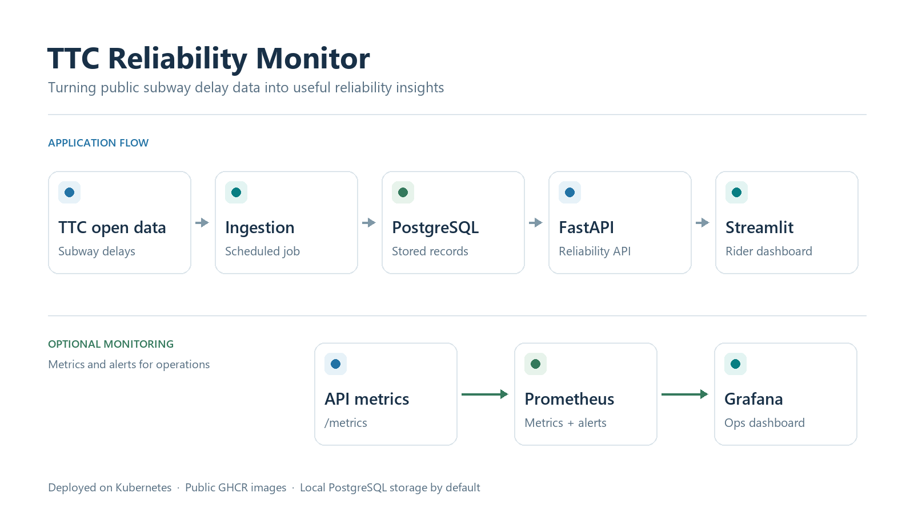
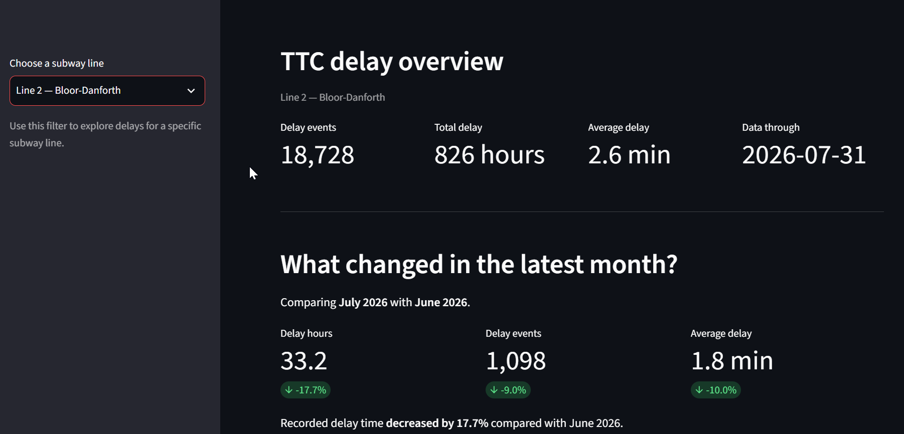

## TTC Reliability Monitor

TTC Reliability Monitor helps people explore how subway delays affect service across Toronto. It brings together public TTC delay data, a data pipeline, an API, and a dashboard to show where delays happen, how long they last, and what causes them.

The project also demonstrates how to run and monitor a data application on Kubernetes, from scheduled ingestion and persistent storage through to a user-facing dashboard.

## How it works

A scheduled job collects TTC Subway Delay Data from City of Toronto Open Data, checks the records, and saves them in PostgreSQL. It can run again without adding duplicate events. The full source dataset is not stored in the repository.

FastAPI uses the stored data to calculate reliability figures. Streamlit presents those figures in a dashboard where people can explore patterns by month, subway line, station, and cause. Optional Prometheus and Grafana monitoring helps track the health of the application and its data pipeline.

## What you can explore

The dashboard gives an at-a-glance view of how often delays occur and how much time they add up to. It shows the latest available data, monthly trends, line comparisons, station rankings, and common causes. Visitors can filter by line or look more closely at individual TTC incident codes. The main views focus on Lines 1, 2, and 4; historical Line 3 records are still included in the data.

**All subway lines:** the dashboard overview and line selector.

**Line 2:** an example of the line filter and month-over-month comparison.

The code descriptions come from official TTC reference data published through City of Toronto Open Data. When no description is available, the dashboard says **Undocumented TTC code**. Its broader cause groups help readers explore the data, but they are not official TTC classifications.

The read-only API makes these results available to the dashboard and other clients:

| Endpoint | What it provides |
| --- | --- |
| `GET /api/v1/reliability/summary` | Overall reliability figures |
| `GET /api/v1/reliability/lines` | Line comparisons |
| `GET /api/v1/reliability/stations` | Station rankings, with line filtering |
| `GET /api/v1/reliability/causes` | Delay-code rankings and descriptions |
| `GET /api/v1/reliability/monthly` | Monthly trends |

Developers can explore the API at `/docs`. The `/health`, `/ready`, and `/metrics` endpoints support health checks and monitoring.

## Running the project

The public installation guide assumes an existing Kubernetes cluster. The application runs in the `ttc-monitor` namespace using public images from GitHub Container Registry, so an `imagePullSecret` is not needed. Kubernetes runs PostgreSQL, a database migration job, scheduled ingestion, the API, and the dashboard. GitHub Actions tests and publishes the application images.

PostgreSQL stores its data through the `postgres-data` PersistentVolumeClaim. By default, this claim uses a local volume on a selected worker node, which keeps the database tied to that node. An NFS volume is available as an alternative when the cluster already has suitable NFS storage.

Monitoring is optional. With `kube-prometheus-stack`, Prometheus can collect API metrics, alert on failed or stale ingestion, and display application and ingestion information in Grafana. The project includes the TTC-specific `ServiceMonitor`, `PrometheusRule`, and Grafana dashboard ConfigMap needed for that integration.

**Grafana:** API performance and ingestion status in the operations dashboard.

The README's published application image examples are `ghcr.io/jorge-ma/ttc-reliability-v2-api:0.1.5` and `ghcr.io/jorge-ma/ttc-reliability-v2-dashboard:0.1.1`. Check the deployment manifests for the image tags used by a particular release.

## Installation guide

See [INSTALLATION.md](INSTALLATION.md) for prerequisites, deployment steps, storage choices, validation, and access to the dashboard and optional monitoring tools.

The README's published application image examples are `ghcr.io/jorge-ma/ttc-reliability-v2-api:0.1.5` and `ghcr.io/jorge-ma/ttc-reliability-v2-dashboard:0.1.1`. Check the deployment manifests for the image tags used by a particular release.

## Installation guide

See [INSTALLATION.md](INSTALLATION.md) for prerequisites, deployment steps, storage choices, validation, and access to the dashboard and optional monitoring tools.
